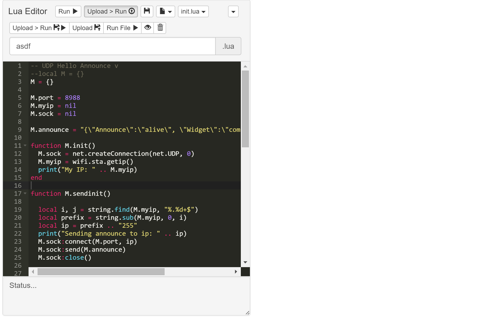

# com-chilipeppr-widget-luaeditor
Edit and run Lua code with a multi-file editor. Save locally or upload/run remotely on the Lua device.



## ChiliPeppr Widget / Lua Editor

All ChiliPeppr widgets/elements are defined using cpdefine() which is a method
that mimics require.js. Each defined object must have a unique ID so it does
not conflict with other ChiliPeppr widgets.

| Item                  | Value           |
| -------------         | ------------- | 
| ID                    | com-chilipeppr-widget-luaeditor |
| Name                  | Widget / Lua Editor |
| Description           | Edit and run Lua code with a multi-file editor. Save locally or upload/run remotely on the Lua device. |
| chilipeppr.load() URL | http://raw.githubusercontent.com/chilipeppr/widget-luaeditor/master/auto-generated-widget.html |
| Edit URL              | http://ide.c9.io/chilipeppr/widget-luaeditor |
| Github URL            | http://github.com/chilipeppr/widget-luaeditor |
| Test URL              | https://preview.c9users.io/chilipeppr/widget-luaeditor/widget.html |

## Example Code for chilipeppr.load() Statement

You can use the code below as a starting point for instantiating this widget 
inside a workspace or from another widget. The key is that you need to load 
your widget inlined into a div so the DOM can parse your HTML, CSS, and 
Javascript. Then you use cprequire() to find your widget's Javascript and get 
back the instance of it.

```javascript
chilipeppr.load(
  "#myDivWidgetInsertedInto",
  "http://raw.githubusercontent.com/chilipeppr/widget-luaeditor/master/auto-generated-widget.html",
  function() {
    // Callback after widget loaded into #myDivWidgetInsertedInto
    cprequire(
      "inline:com-chilipeppr-widget-luaeditor", // the id you gave your widget
      function(mywidget) {
        // Callback that is passed reference to your newly loaded widget
        console.log("My widget just got loaded.", mywidget);
        mywidget.init();
      }
    );
  }
);

```

## Publish

This widget/element publishes the following signals. These signals are owned by this widget/element and are published to all objects inside the ChiliPeppr environment that listen to them via the 
chilipeppr.subscribe(signal, callback) method. 
To better understand how ChiliPeppr's subscribe() method works see amplify.js's documentation at http://amplifyjs.com/api/pubsub/

| Signal | Description |
| ------ | ----------- |
| (No signals defined in this widget/element) |

## Subscribe

This widget/element subscribes to the following signals. These signals are owned by this widget/element. Other objects inside the ChiliPeppr environment can publish to these signals via the chilipeppr.publish(signal, data) method. 
To better understand how ChiliPeppr's publish() method works see amplify.js's documentation at http://amplifyjs.com/api/pubsub/

| Signal | Description |
| ------ | ----------- |
| /com-chilipeppr-widget-luaeditor/loadScript | Publish an object of {name:"myfile.lua", content:"print(\"hello world\")"} and we will open a new tab with the contents of the file. |

## Foreign Publish

This widget/element publishes to the following signals that are owned by other objects. 
To better understand how ChiliPeppr's subscribe() method works see amplify.js's documentation at http://amplifyjs.com/api/pubsub/

| Signal | Description |
| ------ | ----------- |
| (No signals defined in this widget/element) |

## Foreign Subscribe

This widget/element publishes to the following signals that are owned by other objects.
To better understand how ChiliPeppr's publish() method works see amplify.js's documentation at http://amplifyjs.com/api/pubsub/

| Signal | Description |
| ------ | ----------- |
| (No signals defined in this widget/element) |

## Methods / Properties

The table below shows, in order, the methods and properties inside the widget/element.

| Item                  | Type          | Description |
| -------------         | ------------- | ----------- |
| id | string | "com-chilipeppr-widget-luaeditor"<br><br>The ID of the widget. You must define this and make it unique. |
| name | string | "Widget / Lua Editor" |
| desc | string | "Edit and run Lua code with a multi-file editor. Save locally or upload/run remotely on the Lua device." |
| url | string | "http://raw.githubusercontent.com/chilipeppr/widget-luaeditor/master/auto-generated-widget.html" |
| fiddleurl | string | "http://ide.c9.io/chilipeppr/widget-luaeditor" |
| githuburl | string | "http://github.com/chilipeppr/widget-luaeditor" |
| testurl | string | "http://widget-luaeditor-chilipeppr.c9users.io/widget.html" |
| publish | object | Please see docs above.<br><br>Define the publish signals that this widget/element owns or defines so thatother widgets know how to subscribe to them and what they do. |
| subscribe | object | Please see docs above.<br><br>Define the subscribe signals that this widget/element owns or defines so thatother widgets know how to subscribe to them and what they do. |
| foreignPublish | object | Please see docs above.<br><br>Document the foreign publish signals, i.e. signals owned by other widgetsor elements, that this widget/element publishes to. |
| foreignSubscribe | object | Please see docs above.<br><br>Document the foreign subscribe signals, i.e. signals owned by other widgetsor elements, that this widget/element subscribes to. |
| jscript | object |  |
| editor | object |  |
| init | function | function ()  |
| setupSubscribe | function | function () <br><br>Setup subscribe so others can publish to us and ask us toopen a file, i.e. the NodeMCU Files widget sends this to us. |
| loadScript | function | function (data) <br><br>The method that receives the /loadScript publishes |
| loadPrevFiles | function | function ()  |
| getDeviceFileList | function | function ()  |
| aceId | string | "com-chilipeppr-luaeditor"<br><br>The DOM ID of the element that should be the Ace Editor |
| aceSessionName | object |  |
| aceSessions | object |  |
| aceCurrentSession | object |  |
| aceIsLoaded | boolean |  |
| loadAce | function | function (sessionName)  |
| fileNewCtr | number |  |
| fileNew | function | function (evt)  |
| createFileTab | function | function (id, filename)  |
| onFileTabShow | function | function (e)  |
| onFileTabClose | function | function (e)  |
| renameFileNeedSaveAfter | boolean |  |
| renameFileShow | function | function (evt)  |
| renameFileHide | function | function (evt)  |
| renameFile | function | function ()  |
| getActiveFile | function | function ()  |
| fileLocalSave | function | function (evt)  |
| refreshFileList | function | function () <br><br>Update the file pulldown to show the new files in localStorage. |
| fileLocalOpen | function | function (fi)  |
| fileUploadAndRun | function | function (evt)  |
| fileUpload | function | function (evt)  |
| rawUploadAndRun | function | function (txt, filename)  |
| fileDump | function | function (evt)  |
| fileDelete | function | function (evt)  |
| fileRun | function | function (evt)  |
| cleanupFilename | function | function ()  |
| setupUploadRun | function | function () <br><br>Setup the Upload -> Run button |
| onOpenUploadRunRegion | function | function (evt)  |
| onCloseUploadRunRegion | function | function ()  |
| flashMsg | function | function (title, msg)  |
| setupStartup | function | function ()  |
| editStartup | function | function (evt)  |
| saveStartup | function | function (evt)  |
| makeTextareaAcceptTabs | function | function ()  |
| sendCtr | number | Keep a counter so each send has its own ID so we can use jsonSendand get complete statuses back from SPJS when we send each lineto the serial port. |
| send | function | function (txt) <br><br>Send the script off to the serial port. |
| getScript | function | function ()  |
| runScript | function | function (macroStr, helpTxt)  |
| jscriptKeypress | function | function (evt)  |
| saveTemporaryFile | function | function (evt)  |
| getTemporaryFile | function | function ()  |
| setScriptFromTemporaryFile | function | function ()  |
| showData | function | function (datatxt)  |
| saveScript | function | function ()  |
| deleteRecentFiles | function | function ()  |
| createRecentFileEntry | function | function (fileStr, info)  |
| buildRecentFileMenu | function | function ()  |
| loadFileFromLocalStorageKey | function | function (key)  |
| resizeEditor | function | function ()  |
| resize | function | function () <br><br>Resize the widget to the height of the window |
| loadJscript | function | function (txt)  |
| setupSamples | function | function ()  |
| getMethodString | function | function (methodToGet)  |
| autoAddMacros | object |  |
| generateZigZag | function | function () <br><br>This macro helps you generate a zig zag toolpath inside of an overall rectangular shape. Give it the width and height of the rectangularshape. Then give it the step over value and it will generate the gcode and then send it to the workspace so you can visualize it and run it.<br><br>This can be used to mill out or pocket a workpiece. It can also be used to scan a laserover a surface to ablate or cure materialby scanning back and forth with a step over. |
| sendSerial | function | function (gcode)  |
| statEl | object |  |
| status | function | function (txt)  |
| forkSetup | function | function () <br><br>Add the fork menu to upper right corner caret. |


## About ChiliPeppr

[ChiliPeppr](http://chilipeppr.com) is a hardware fiddle, meaning it is a 
website that lets you easily
create a workspace to fiddle with your hardware from software. ChiliPeppr provides
a [Serial Port JSON Server](https://github.com/johnlauer/serial-port-json-server) 
that you run locally on your computer, or remotely on another computer, to connect to 
the serial port of your hardware like an Arduino or other microcontroller.

You then create a workspace at ChiliPeppr.com that connects to your hardware 
by starting from scratch or forking somebody else's
workspace that is close to what you are after. Then you write widgets in
Javascript that interact with your hardware by forking the base template 
widget or forking another widget that
is similar to what you are trying to build.

ChiliPeppr is massively capable such that the workspaces for 
[TinyG](http://chilipeppr.com/tinyg) and [Grbl](http://chilipeppr.com/grbl) CNC 
controllers have become full-fledged CNC machine management software used by
tens of thousands.

ChiliPeppr has inspired many people in the hardware/software world to use the
browser and Javascript as the foundation for interacting with hardware. The
Arduino team in Italy caught wind of ChiliPeppr and now
ChiliPeppr's Serial Port JSON Server is the basis for the 
[Arduino's new web IDE](https://create.arduino.cc/). If the Arduino team is excited about building on top
of ChiliPeppr, what
will you build on top of it?


